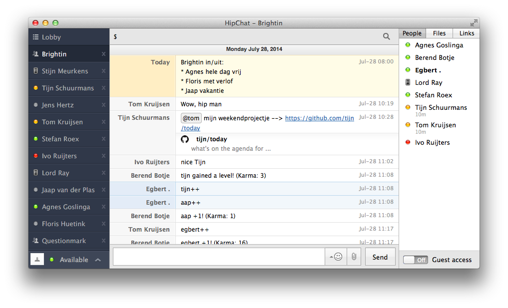

# Today


## What?

Shout out on Hipchat what's on a google calendar for today



## Huh? Why?

At our office, every day is different. You never know who you can expect to see there. Some collegues will visit clients, others are doing part time academic work, someone could have a day off or maybe working from home... you get the gist. This little project grew out of the need to be informed about how many people one can expect to see at the office.

Obviously we jot this all this information down in a calendar but I'm too lazy for looking that thing up every day. I simply want an app to shout it at me on HipChat while I have breakfast.


## How can I have this too?

You need a YAML file with your config, something like this:

```yaml
in_and_out:
  calendar_url: {{your calendar as xml}}
  hipchat_token: {{a token for HipChat}}
  hipchat_room: {{the room in which you want to read your msg}}
another_calendar:
  hipchat_room: {{your calendar as xml}}
  hipchat_token: {{a token for HipChat}}
  hipchat_room: {{the room in which you want to read your msg}}
```

You may specify as many configs as you want.

Then you feed this config to the script to see if it works:

```sh
bin/today_on_hipchat < my_superawesome_configuration.yml
```

And you set up the obvious cron job for it.

## Example Cron-job

A typical use would be to call Today in a daily cron-job.
You can use the script below as a starting point.
(mainly useful to see how to use rbenv with this)

```sh
#!/bin/sh

export PATH="$HOME/.rbenv/shims:$HOME/.rbenv/bin:$PATH"
eval "$(rbenv init -)"
bin/today_on_hipchat < config.yml
```

## Known issues

**It doesn't deal with time zones at all.**

This is not a problem for me since our company is not geographically dispersed. Besides I just let the cron job run at 7 AM or so. It'll be fine in winter and summer time. But if you want to improve it: please send a pull request!
